Introducción.

este proyecto corresponde a la tercera entrega del área ciclo de software. el objetivo es demostrar como integrar buenas practicas de desarrollo moderno en un flujo automatizado que garantice reproducibilidad, calidad del código y seguridad en las dependencias.

se pueden visualizar mejoras 
en las pruebas unitarias con Jest para asegurar la correcta funcionalidad de los Value Objects y componentes críticos.
Linting y formateo automático con ESLint y Prettier, manteniendo un estilo de código consistente.
Automatización en GitHub Actions, que ejecuta pruebas, linting y construcción de la aplicación en cada push.
Construcción de imágenes Docker reproducibles, listas para despliegue en entornos productivos.
Escaneo de vulnerabilidades con Docker Scout, garantizando que las dependencias críticas se mantengan libres de riesgos HIGH/CRITICAL.

Objetivos del Proyecto
El propósito principal de este laboratorio es integrar prácticas de calidad y seguridad dentro de un flujo de CI/CD moderno. Los objetivos específicos son:
Automatizar el ciclo de integración continua (CI/CD) mediante GitHub Actions, asegurando que cada cambio en el repositorio dispare pruebas, linting y construcción de la aplicación.
Garantizar la calidad del código con pruebas unitarias en Jest y reglas de estilo con ESLint y Prettier.
Asegurar reproducibilidad en la construcción de imágenes Docker, evitando configuraciones manuales y asegurando entornos consistentes.
Detectar y mitigar vulnerabilidades en dependencias mediante el uso de Docker Scout y npm audit, priorizando la eliminación de riesgos HIGH/CRITICAL.
Promover buenas prácticas de DevSecOps, integrando seguridad desde la etapa de desarrollo y no como un paso posterior.

para empezar se configuran los archivos utilizados en Npm para verificar que las pruebas unitarias funcionen, además se ingresan en los códigos las variables de entorno de synk y sonarQube, sincronizadas de igual manera desde sus respectivas aplicciones con GitHub por medio de token de acceso.

que es SonarQube Cloud
sirve para analizar automáticamente el código fuente en la nube, detectando errores, bugs, vulnerabilidades de seguridad, y "malos olores" de código, ayudando a los equipos a mantener la calidad del software, mejorar la seguridad y acelerar el desarrollo al integrarse en flujos de trabajo DevOps y CI/CD . Es una olucion Saas que ofrece recomendaciones de corrección, análisis de código abierto y de infraestructura como código (IaC), y es una versión en la nube de la plataforma SonarQUBE.

Funciones principales:
•Detección de problemas: Encuentra errores, vulnerabilidades (OWASP Top 10, inyecciones), secretos codificados y puntos críticos de seguridad.
•Análisis de seguridad (SAST & SCA): Realiza análisis estático (SAST) para encontrar fallos complejos y análisis de composición de software (SCA) para dependencias de terceros.
•Integración DevOps: Se conecta con plataformas como GitHub, GitLab y Bitbucket para analizar código en cada commit o pull request, integrándose en el pipeline de CI/CD.
•Análisis de Infraestructura como Código (IaC): Escanea configuraciones en Terraform, Kubernetes, Docker, etc., para detectar errores de configuración.
•Retroalimentación y Mejora: Proporciona sugerencias detalladas y documentación para que los desarrolladores corrijan el código, mejorando sus habilidades.
•IA para corrección (AI CodeFix): Ofrece recomendaciones de corrección de código impulsadas por inteligencia artificial. 
¿Para quién es?
•Equipos de desarrollo que trabajan en la nube y usan plataformas DevOps/SaaS.
•Proyectos de software que buscan calidad, seguridad y mantenibilidad continua. 

### Creación Token desde SonarQube
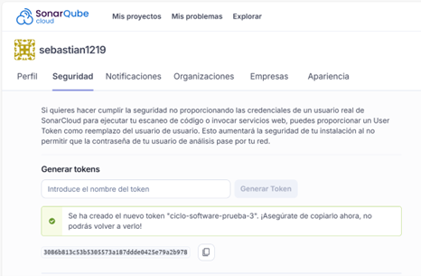

### agregar Sonar Token a github

### visualización token
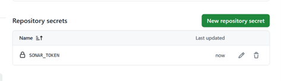

una vez que agregamos el token a nuestro repositorio para permitir la sincronización. generamos un push y deberías visualizar nuestro worflows funcionando , y de esa manera podemos darnos cuenta que nuestro pipeline CI esta funcionando

### visualización worflows
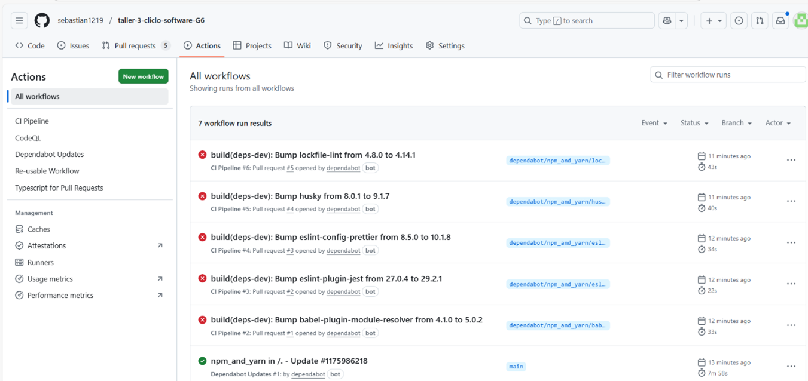

para crear el worflows se crea el archivo security.yml, donde se encargara de 
Synk --- detectar vulnerabilidades en dependencias.
GHAS (GitHub Advance Security) --- activar CodeQL, secret scanning y dependency review.
Docker Scout --- mas adelante, cuando contruyamos la imagen Docker.

### sincronización sonarQube

### se Accede a Synk para generar token
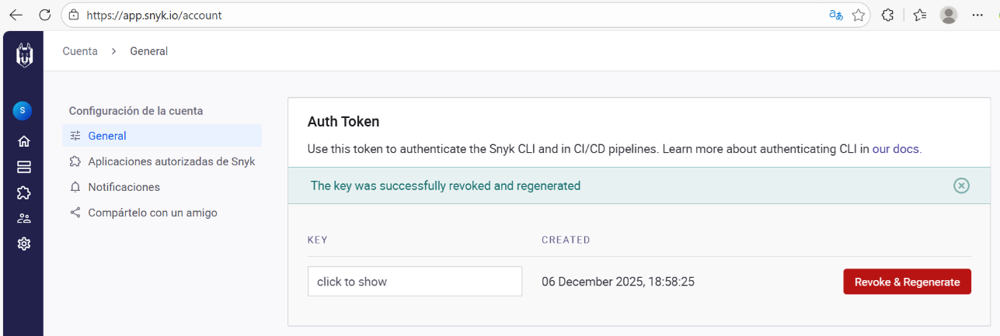

Se genera el token el cual se sincroniza con el repositorio de github para el análisis

### token synk en github
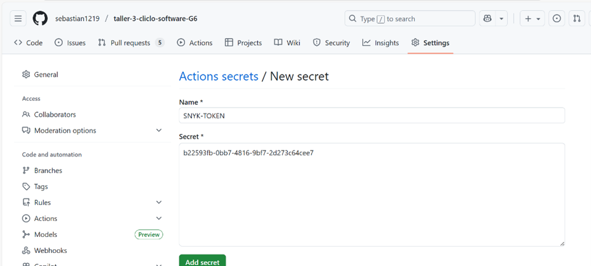

### visualización tokens
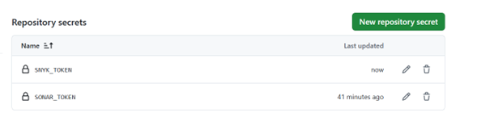

Para probar que esta funcionando de instala snyk, se autentica con el token generado desde snyk, y se emplea el test, en el podemos observar que esta sincronizado y funcionando con nuestro repositorio GitHub

### synk test desde la shell
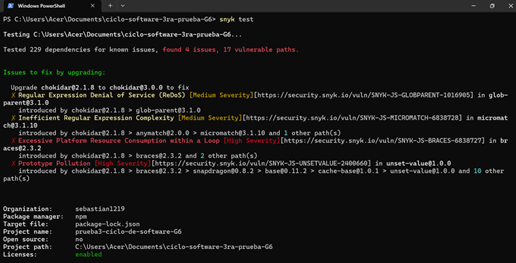

### visualización permisos script de seguridad

en este fragmento se detallan permisos
en el script de securiyy.yml se puede detallar
que se habilita CodeQL, puede subir resultados a la pestaña security -- Code Scanning alerts.

Jobs:

Snyk: corre en cada push/PR, usa tu SNYK_TOKEN y ya vimos que detecta vulnerabilidades.
CodeQL: ahora sí tiene permisos para subir hallazgos.
Dependency Review: condicionado con if: github.event_name == 'pull_request', así no falla en pushes y solo corre en PRs (que es su propósito).
Triggers:
Corre en push y pull_request hacia develop y main.
Corre también en un cron semanal (lunes a las 03:00 UTC).

✅ Resultado esperado
En cada push/PR, Snyk y CodeQL se ejecutan.
En PRs, además corre Dependency Review.
Los hallazgos de CodeQL aparecerán en la pestaña Security → Code scanning alerts del repo.
Los hallazgos de Snyk se verán en los logs del workflow y también en la pestaña Security → Dependabot/Snyk si habilitas la integración.

### sincronización desde github
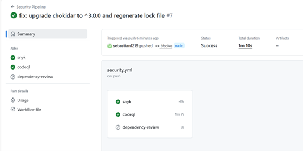

se puede observar al momento del push, como synk y codeQl analizan el pipeline 

### visualización workflows
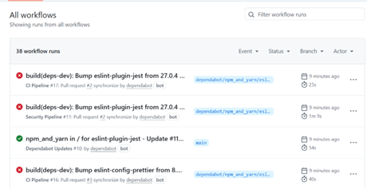

que significan los 38 runs

Dependabot: Cada vez que Dependabot abre o sincroniza un PR para actualizar una dependencia (eslint-plugin-jest, eslint-config-prettier, husky, etc.), se disparan automáticamente tus workflows:
CI Pipeline → corre tus pruebas de integración continua.
Security Pipeline → corre Snyk, CodeQL y Dependency Review sobre ese PR.
Dependabot Updates → registro del propio bot cuando actualiza el lock file.
Tus commits manuales (fix: upgrade chokidar…, fix: corrige indentación…) también disparan ambos pipelines. Por eso ves runs duplicados: uno para CI y otro para Security en cada push/PR.

✅ Lo que indica que está bien
CI Pipeline: corre rápido (20–40s) y valida que el proyecto compile/testee.
Security Pipeline: tarda más (1m+) porque hace análisis de dependencias y código.
Dependabot: genera muchos runs seguidos porque está actualizando varias librerías dev (eslint, husky, babel-plugin-module-resolver, etc.).
👉 En un laboratorio de seguridad es normal ver decenas de runs en poco tiempo, especialmente cuando Dependabot está activo y tu workflow dispara tanto en push como en pull_request.
Para evitar que dependabot dispare en cada Pull request un análisis y ejecute muchos disparadores se agrupan 

### visualización workflows
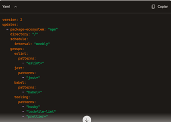

en este código podemos observar lo siguiente

groups → Dependabot ya no abre un PR por cada paquete, sino que agrupa:
Todos los paquetes que empiezan con eslint en un solo PR.
Todos los relacionados con jest en otro.
Todos los de babel en otro.
Herramientas como husky, lockfile-lint, prettier en otro.

Para evitar estos errores de compatibilidad entre versiones, se debe modificar el package.json y el security.yaml

### visualización despligue fallido
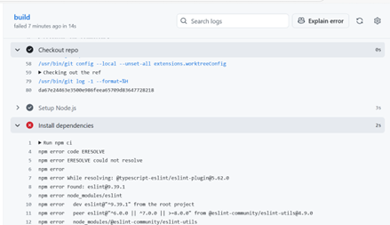

podemos ver dos disparadores, en el que se visualiza el error se puede ver que son temas de variables, lo que quiere decir que nuestro análisis encuentra fallas. En otras palabras esta analizando nuestro código

### visualización disparadores
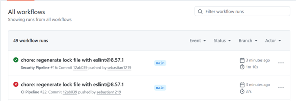

### visualización disparadores
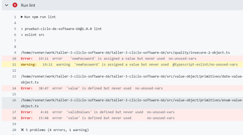

en el disparador que esta ok, observamos snyk y codeql que ejecutar los análisis satisfactoriamente, además observamos que dependency-review no corre debido a que estamos generando un push directo desde la rama main, y funciona solamente desde un pull request

### visualización de analisis
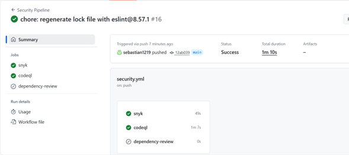

### visualización de analisis
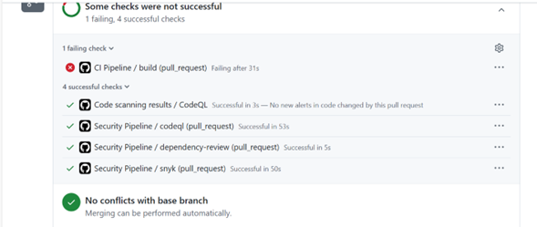

hacemos la prueba y desde otra rama ejecutamos pull request, y al observar nos damos cuenta que dependency-review analiza nuestro codigo

### visualización de analisis

podemos observar desde la pestaña seguridad, en escaneo de códigos, ciertas vulnerabilidades

### visualización vulnerabilidades desde github
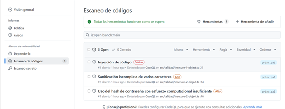

¿Qué significa “Escaneo de códigos: Todas las herramientas funcionan como se esperan
Significa que el workflow de seguridad corrió correctamente.
Las herramientas como CodeQL, Snyk y Dependency Review se ejecutaron sin errores.
GitHub detectó vulnerabilidades en tu código gracias a CodeQL.

Alertas detectadas por CodeQL
Estas son vulnerabilidades reales en tu código fuente, clasificadas por severidad:

### vulnerabilidades encontradas

¿Por qué es importante?
Estas alertas te ayudan a identificar y corregir vulnerabilidades antes de que lleguen a producción.
CodeQL hace análisis estático del código y detecta patrones inseguros automáticamente.
Cada alerta tiene un número (#1, #2, #3) y está abierta en la rama main, lo que significa que aún no han sido corregidas.

### Configuración de Docker scout
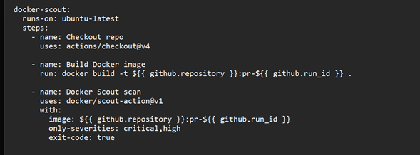

Explicación de cada paso
Build Docker image: construye la imagen de tu aplicación con el tag pr-${{ github.run_id }} (único por ejecución).
Docker Scout scan: analiza esa imagen.
only-severities: critical,high → solo considera vulnerabilidades graves.
exit-code: true → si encuentra alguna, el job falla y el pipeline se detiene.
Resultado esperado
En cada push a develop y pull request a main, Docker Scout construirá la imagen y la escaneará.
Si hay vulnerabilidades críticas o altas, el pipeline marcará error y no se publicará la imagen en Docker Hub.
Si todo está limpio, el job pasa en verde y el flujo continúa.

### Configuración de Docker scout
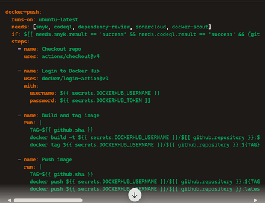

Qué logramos con esto
needs: asegura que el job de publicación solo corre si todos los análisis previos pasaron.
if: añade condiciones extra para que en PRs también se validen SonarCloud y Dependency Review.
docker login: usa tus secrets DOCKERHUB_USERNAME y DOCKERHUB_TOKEN.
build & push: publica la imagen con dos tags: el SHA del commit y latest.

Flujo completo
Push a develop → se construye la imagen, se escanea con Docker Scout, Snyk, CodeQL, y si todo pasa, se publica en Docker Hub.
Pull request a main → además de lo anterior, corren SonarCloud y Dependency Review; si pasan, se publica.
Quality gates → cualquier vulnerabilidad crítica o alta bloquea el despliegue.

Construcción de la imagen

Se genera la imagen de tu aplicación en cada push a develop y PR a main.
Tag único por ejecución (pr-${{ github.run_id }} o el SHA del commit).
Escaneo con Docker Scout
Analiza la imagen recién construida.
Si detecta vulnerabilidades críticas o altas, el job falla y el pipeline se detiene.
Esto asegura que no publiques imágenes inseguras.
Publicación condicionada en Docker Hub
Solo si Docker Scout, Snyk, CodeQL, Dependency Review y SonarCloud pasan en verde.
Se publica con dos tags: el SHA del commit y latest.

Se crea un pull request para verificar el funcionamiento y la sincronización de Docker scout

### pull request
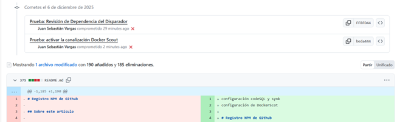

### código Dockerfile
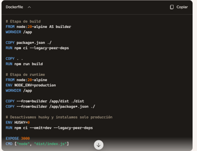

¿Por qué Husky da problemas?
Husky es una librería que instala git hooks (pre-commit, pre-push, etc.).
Durante npm ci, Husky ejecuta su script prepare para instalar esos hooks.
En un contenedor Docker:
No hay .git ni entorno de desarrollo.
Alpine es minimalista y carece de herramientas como git.
Resultado: Husky falla con exit code 127.

Repercusiones de desactivar Husky en Docker
En desarrollo local: Husky sigue funcionando, instalando hooks y evitando commits con errores.
En Docker/producción: Husky se desactiva porque no tiene sentido instalar hooks dentro de un contenedor.
Impacto real: ninguno en producción. Los hooks son solo para el flujo de trabajo de los desarrolladores, no para la ejecución de la aplicación.

En otras palabras: desactivar Husky en Docker es correcto y no afecta la seguridad ni la funcionalidad de tu app en producción.
Conclusión
El Dockerfile multi-stage asegura que tu imagen final sea ligera y optimizada.
Husky debe desactivarse en contenedores porque sus hooks no aplican en producción.
La repercusión es mínima: pierdes los hooks dentro del contenedor, pero mantienes la funcionalidad en tu repo local.

Creación de imagen Docker con build 

### imagen con Dockerbuild

se puede observar en los flujos de trabajo con el CI se despliega correctamente y el Docker Build de la misma forma. En security pipeline nos damos cuenta que el despliegue no fue exitoso. Al momento de detectar una vulnerabilidad quiebra la integración

### imagen con Dockerbuild
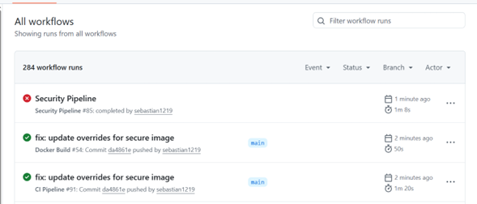

Visualizamos el análisis desde snyk y codeql exitoso y por la vulnerabilidad de incompatibilidad entre versiones con Windows se genera un break

### analisis
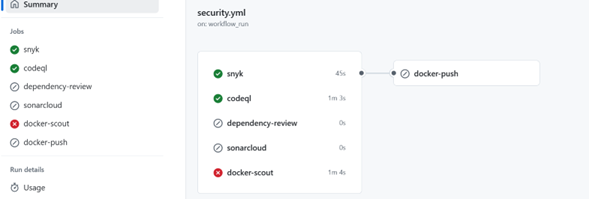

